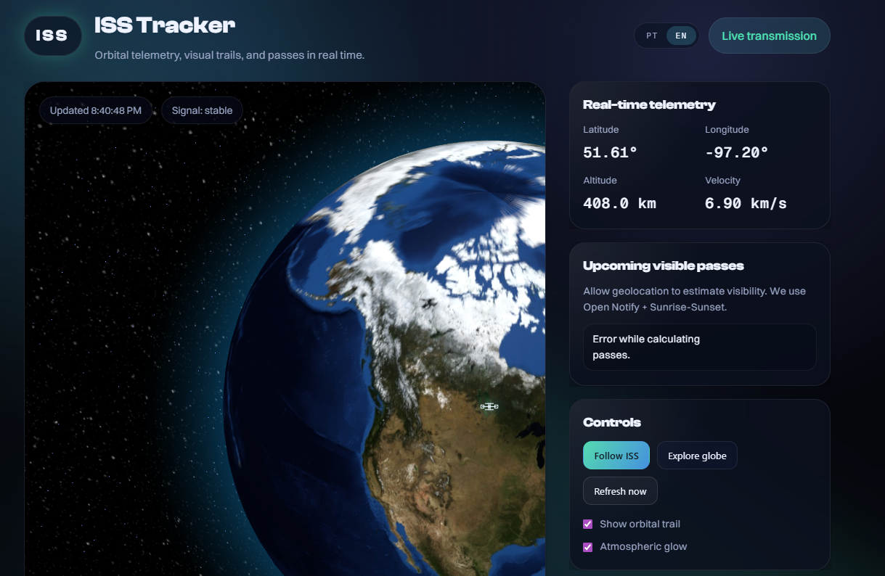

# ISS Tracker

[Leia em ingles](README.md)

  

Um rastreador da ISS em tempo real com globo 3D, trilha orbital, painel de telemetria e previsao de passagens visiveis. Interface polida e imersiva que consome dados ao vivo e renderiza a posicao da ISS em um globo WebGL.

## Funcionalidades

- Posicao da ISS ao vivo com visualizacao em globo 3D
- Alternancia da trilha orbital
- Telemetria (lat, lon, altitude, velocidade)
- Previsao de passagens visiveis baseada na sua localizacao
- Alternancia de idioma (English / Portugues)
- UI responsiva com visual glassmorphism

## Fontes de Dados

- Open Notify (posicao da ISS + previsoes de passagem)
- Sunrise-Sunset (janela dia/noite para visibilidade)

## Stack

- HTML, CSS, JavaScript
- Three.js + Globe.gl (renderizacao 3D)
- Google Fonts + Fontshare (tipografia)

## Como Rodar

Este projeto e estatico. Qualquer servidor local funciona.

1. Abra a pasta do projeto em um servidor local (ex: Live Server no VS Code).
2. Permita a geolocalizacao quando solicitado para previsoes de passagens.

## Observacoes

- Open Notify e servido via HTTP. Se voce abrir a pagina via HTTPS, o navegador pode bloquear por mixed content. Use um servidor local HTTP no desenvolvimento ou faca proxy das requisicoes.
- A altitude esta fixa em 408 km apenas para exibicao.

## Estrutura do Projeto

- index.html
- styles.css
- app.js
- assets/ (referencias de design)

## Licenca

Este projeto e apenas para fins educacionais e demonstrativos.
